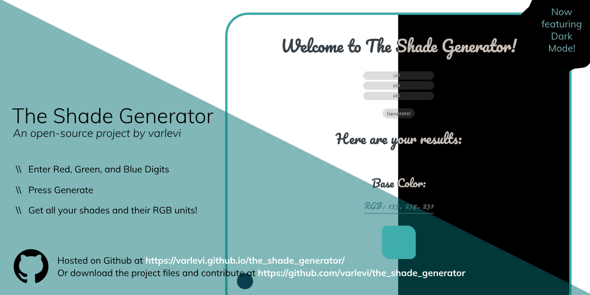

# the_shade_generator

Hi everyone! Varlevi here with a new project. This project is an online web app to be used by web designers and developers that returns all the shades of a color the user inputs. Its fairly simple right now and runs purely on vanilla JavaScript, but I'll be adding new features in the near future.
